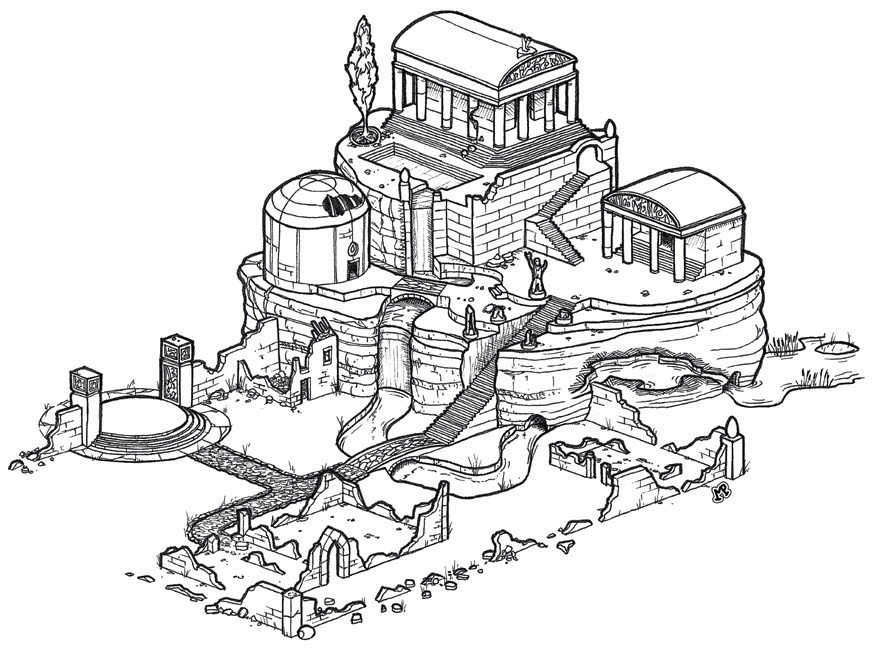

# Temple of Raei

There is an old temple mound to [Raei](Raei.md) outside of [Hammerkeep](Hammerkeep.md) in the [Copper Hills](CopperHills.md). It's been abandoned for decades and any trails to it are long overgrown, but at one time it had a library.

<!--In [IC4996](IC4996.md) it's being used as a bandit base of operations by the [Blighted Order](BlightedOrder.md). They have somehow been spared the [Sereno](Sereno.md) illness.-->

> [places](places.md)
> [temples](temples)
> [factions](factions.md)