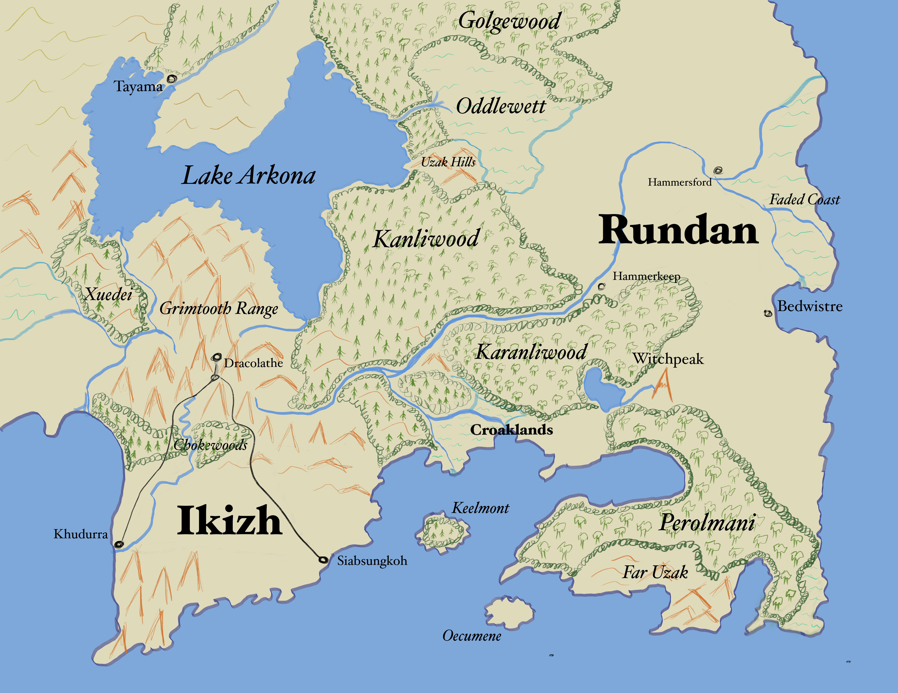

This rump of the world known as [Nuoro](Nuoro.md) has many places. Everywhere has many places, really. There's practically no reason to go looking through this list because each of these places has more places within. Same goes for history. I can't detail history for you, because there's more of it than there are moments to use recording it, right? So you get fragments. Be glad of it, because if we unspooled the entirety you'd run into a paradox sooner or later, and that's where the outsider arcanematics will get you.

## History

What is history apart from a bunch of things that happened? At the time of this writing[^1] the things that are happening are different depending on where you are, obviously. 

If you're in [Dracolathe](Dracolathe.md) I'm sure you are concerned about the way food isn't getting into the city to feed your prattling maw. Historically we could draw a bunch of lines between your growling belly and the [Grim War](GrimWar.md) and the decisions made by a far-off emperor to reward [some people](Dragonborn.md) some people with the homes of [another people](Dwarf.md). 

But on the edges of the [Kanliwood](Kanliwood.md) in [Rundan](Rundan.md) the recent increase (as compared to what people remember their parents telling them or the long-lifers remember firsthand) in monster sightings means food policy in [Ikizh](Ikizh.md) isn't that top of mind. Maybe all the deeds of the gods aeons ago are actually what's driving the weirdness in the woods. Or maybe there are just a pile of weird wizards doing weird wizard shit.

What I'm trying to get at here is that "history" isn't a good way of getting to know [Nuoro](Nuoro.md), especially for you, my reader displaced from me in time and space. Beyond the people you get to know, how much do you really care? Historians, arcanists and theologians can go into all sorts of details on how they say the world got to be this way, and some of them might even be right.

[^1]: In the Imperial Calendar the year is [IC4996](IC4996.md).
## A Sketch of Civilization
What we can say is that [Nuoro](Nuoro.md) is a fragmented land. The fertile kingdom of [Rundan](Rundan.md) in the east is part of the continental [Dantag Empire](DantagEmpire.md). [Ikizh](Ikizh.md) is the slightly less religious queendom in the southwest, with the nominally Imperial [Dracolathe](Dracolathe.md) in the [Grimteeth](Grimteeth.md) and the vast uncivilized forests in between. Nobody who lives outside the northwest (mostly [Orc](Orc.md) and [Goliath](Goliath.md) groups) cares about anywhere past [Tayama](Tayama.md). 

* [Bedwistre](Bedwistre.md)
* [Blackstone](Blackstone.md)
* [Chokewoods](Chokewoods.md)
* [Croaklands](Croaklands.md)
* [Dracolathe](Dracolathe.md)
* [DwarfRoad](DwarfRoad.md)
* [FadedCoast](FadedCoast.md)
* [FarUzak](FarUzak.md)
* [Golgewood](Golgewood.md)
* [Grimtooth Mountains](Grimteeth.md)
* [Hammersford](Hammersford.md) & [Hammerkeep](Hammerkeep.md)
* [Ikizh](Ikizh.md)
* [Kanliwood](Kanliwood.md) & [Karanliwood](Karanliwood.md)
* [Keelmont](Keelmont.md)
* [Khudurra](Khudurra.md)
* [LakeArkona](LakeArkona.md)
* [NuoroRiver](NuoroRiver.md)
* [Oddlewett](Oddlewett.md)
* [Oecumene](Oecumene.md)
* [Perolmani](Perolmani.md)
* [Rundan](Rundan.md)
* [Tayama](Tayama.md)
* [UzakHills](UzakHills.md)
* [Witchpeak](Witchpeak.md)
* [Xuedei](Xuedei.md)
* [Zhaalum](Zhaalum.md)

## Beyond the Island

Many people still don't believe [Nuoro](Nuoro.md) is an island. I don't know what to tell them, but I usually don't have to tell them anything because they stay at home never going five miles from their front door. Regardless, Nuoro is actually an island and the world is bigger than here.

Most of the [Dantag Empire](DantagEmpire.md) is about a hundred miles across the sea to the east on the [Anor](Anor.md) landmass[^2]. You can sail across in a day or two, but not a lot of people do.

Sailing southwest of Nuoro is where you find a lot more stuff. According to Three Finger Farza, the Continent of [Noricum](Noricum.md) is about 900 miles that way and it's got lots of people and small countries like [Halruaa](Halruaa.md), [Mulhorand](Mulhorand.md) and [Zakhara](Zakhara.md). Before you get there you might end up at one of the small island nations, including [Chult](Chult.md).

An even farther voyage across [Anor](Anor.md) and then sailing east might bring you to [Uradun](Uradun.md), and going north into the ice, could bring you to [Yldstead](Yldstead.md) if you don't die on the way.

[^2]: Technically Anor might be an island too, but it's big enough I don't know any one person in history who's sailed around the whole thing.